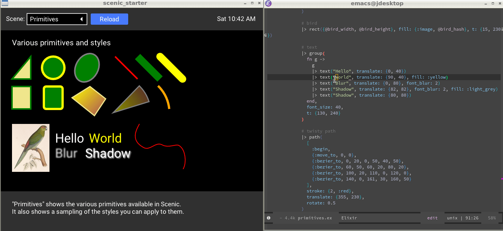

Scenic Starter Pack is a kit that helps you easily get up and running with
Scenic. It is directly based on the
[scenic_new](https://github.com/boydm/scenic_new) starter application but it
adds live reload. Simply edit a file in the project and save it, then it will
reload the currently selected scene!

To try it out after you have the project running (see below) in
`lib/scenes/components.ex` try changing the `"Primary"` button to instead read
`"First!"` and you should see the button on the text change.

# Demo

In this demo I replace the text "World" with "Scenic", then change the color of
the text to purple. Next I change the shape of the bezier line.

# Installation

Clone the repository

    mix deps.get

# Running

    mix scenic.run
    
or

    iex -S mix

Then edit a file and you will see the changes reflected live!

# How it works

Live compilation is provided
[ScenicLiveReload](https://github.com/axelson/scenic_live_reload) (which uses
[ExSync](https://github.com/falood/exsync) to do the heavy lifting). The flow
goes like this:

1. You edit a `.ex` file in your editor
2. ExSync detects the file edit and recompiles and reloads the file you edited
3. If there are no further file edits than ExSync calls the configured `:reload_callback`
4. The default `:reload_callback` calls into `ScenicLiveReload` which finds the
   current root scene and kills it
5. The root scene's supervisor then restarts the root scene with the new code
   that you just wrote

# Adding your own scene

No special hooks are needed to add your own scene. You just create it and switch to it, likely using code like `ViewPort.set_root(viewport, {MyApp.Scene.SceneName, nil})`
    
Optionally add your new scene to the dropdown list in the `ScenicStarter.Component.Nav` component

Optionally, if you want your new scene to load on startup then add set it as the second or only scene in `config/config.exs` in the `:default_scene` tuple
